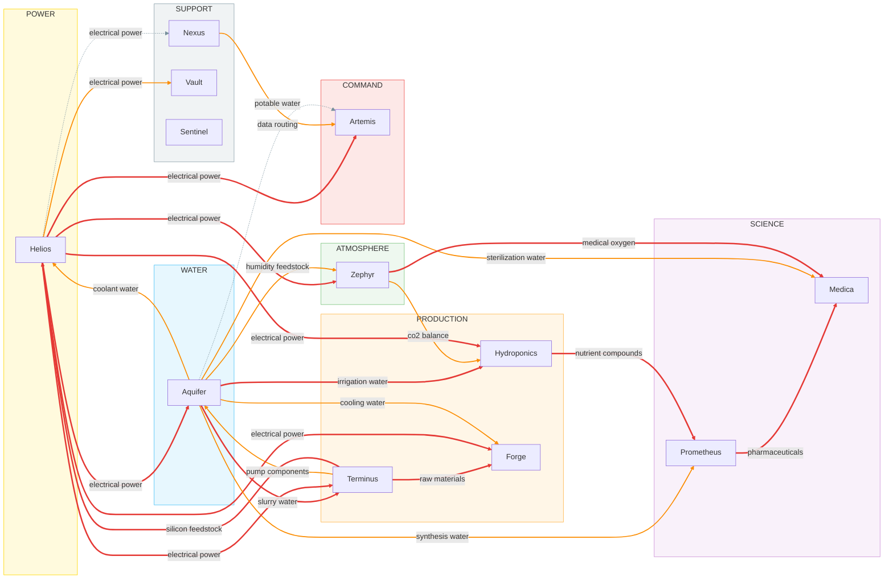

# Project Selene — Infrastructure Resilience Assessment
### Prepared for Phase 3 Expansion Review | Report Date: 2094-07-28

---

## 1. Executive Summary

Project Selene supports 147 residents across 12 pods and presents as operationally stable — all pods report nominal status, no unplanned outages have occurred in over 943 days of continuous operation, and the colony has met population and production milestones ahead of schedule. However, this surface stability conceals a critically fragile infrastructure architecture. The Colony Resilience Index stands at **0/100 (Grade: F)**, driven by a Cascade Containment score of 0/100, three mutual dependency loops, and 13 high-criticality single points of failure. A sustained sequence of policy decisions between 2093 and 2094 — each defensible in isolation — has systematically dismantled every water and power redundancy the colony originally possessed. Phase 3 expansion must not proceed without addressing these structural vulnerabilities; adding population and load to this architecture amplifies, rather than distributes, catastrophic risk.

---

## 2. Colony Infrastructure Map

The colony's 12 pods organize naturally into five functional layers:

**Command & Administration:** `artemis` (port 3002) serves as the colony's administrative hub, issuing directives, managing 147 personnel across five departments, and maintaining Earth communications via `nexus`. It is a consumer of resources from multiple pods but produces no physical supply that other pods declare as a dependency.

**Power Generation:** `helios` (port 3001) is the sole electrical power source for the entire colony grid, serving 9 grid sectors and 8 dependent pods. It is the apex provider in the infrastructure graph.

**Water & Atmosphere:** `aquifer` (port 3004) and `zephyr` (port 3005) form the colony's life-support backbone. Aquifer distributes water across 7 loops to 8 consumers; Zephyr processes atmosphere and generates 180 kg O₂/day for the 284,000 m³ atmospheric volume.

**Production & Extraction:** `terminus` (port 3008), `forge` (port 3010), and `prometheus` (port 3006) form the industrial and research tier. Terminus feeds raw materials and silicon upward to Helios and Forge; Forge manufactures components that maintain Aquifer and Terminus; Prometheus synthesizes pharmaceuticals for Medica.

**Support & Monitoring:** `hydroponics` (port 3003), `medica` (port 3007), `vault` (port 3011), `sentinel` (port 3012), and `nexus` (port 3009) provide food, healthcare, emergency reserves, external surveillance, and communications. `sentinel` is the only pod with declared full operational independence from the colony grid.

The dependency graph contains three confirmed mutual dependency loops: **helios ↔ aquifer** (power for coolant, coolant for power), **helios ↔ terminus** (power for extraction, silicon for panels), and **aquifer ↔ terminus** (slurry water for mining, pump components for water distribution). These loops mean no node in the production/power/water triangle can fail without immediately impairing the others.

---

## 3. Critical Dependencies

### Helios Station — 8 pods depend on it

Helios is the most depended-upon pod in the colony, supplying electrical power to: `zephyr`, `hydroponics`, `aquifer`, `artemis`, `terminus`, `forge`, `medica` (per Helios supply list, despite Medica's dependency omission), `vault`, and `nexus`. At 4,200 kW output across 9 grid sectors, with 340 solar panels degrading at 1.2%/year, and a battery reserve currently at 78%, Helios has no backup generation source. The colony grid is entirely single-threaded through one solar installation.

### Aquifer Module — 8 pods depend on it

Aquifer distributes water across 7 named loops at 41,200 L/day average throughput (91.6% of 45,000 L/day rated capacity, as of the 2094-05-19 capacity report). It supplies coolant to Helios, slurry water to Terminus, irrigation to Hydroponics, synthesis water (via Hydroponics circuit, post-project 2093-P4) to Prometheus, humidity feedstock to Zephyr, cooling water to Forge, sterilization water to Medica, and potable water to Artemis. It carries **zero backup systems** per its current specs.

### Terminus Mine — 3 direct dependents, 10 total cascade

While only 3 pods directly depend on Terminus (Helios, Aquifer, Forge), a Terminus failure cascades to 10 pods in two steps — matching the total impact of Helios and Aquifer failures — because it sits at the root of the silicon-power-water triangle. The 2094-04-20 maintenance log noted silicon consumption at 140% of quarterly forecast for a single cluster B3 repair, highlighting the sensitivity of Helios's operational continuity to Terminus's output.

---

## 4. Single Points of Failure Analysis

The analytics identify **24 single points of failure** across the colony: 13 high-criticality, 9 medium-criticality, and 2 low-criticality.

### Power (Helios)
Every pod except `sentinel` depends on Helios for electrical power, with 7 of those relationships rated high-criticality. Helios itself has no backup generation. The battery reserve of 78% provides a buffer of uncertain duration — Zephyr's 2094-05-02 message to `helios_ops` asking about backup power capacity for their sector received no documented response, and Zephyr's own backup is only **4 hours**. A sustained Helios outage — from a micrometeorite impact on the panel array, a cooling failure, or a grid fault — immediately removes power from all colony systems simultaneously.

### Water (Aquifer)
Aquifer is the sole source of 8 distinct resource streams across 7 pods. Critically, **backup_systems: 0** in Aquifer's current specs. The vault's secondary water reserve system — which existed at commissioning and was confirmed operational in the 2092-12-01 inventory audit — was transferred to maintenance reserve status in March 2093 per Directive 2093-089, with vault manager Torres formally confirming on 2094-02-10: *"no active water backup capability at this time."* Artemis acknowledged this on 2094-04-12 without initiating any corrective action.

### Pharmaceuticals (Prometheus → Medica)
Prometheus is the sole source of pharmaceuticals for Medica Ward. The 2094-07-28 pharmacy stock review confirms only **12 days of critical medications on hand** — at policy minimums. A Prometheus disruption directly threatens medical capability within two weeks. The 2094-05-30 comms show this supply chain is active and routine, but there is no logged secondary synthesis source or stockpile buffer beyond 12 days.

### Medical Oxygen (Zephyr → Medica)
Zephyr holds a **6-hour** oxygen reserve per Medica's specs. With Zephyr's own backup power rated at 4 hours, an extended Helios outage exhausts Zephyr's power before Medica exhausts its oxygen — making this a near-simultaneous double failure. Zephyr confirmed on 2094-03-18 that its humidity feedstock is now **100% sourced from Aquifer**, having retired its internal reclamation loop in June 2093.

### Silicon Supply (Terminus → Helios)
Terminus is the sole source of silicon feedstock required for panel maintenance and replacement. With panel degradation at 1.2%/year and consumption running at 140% of forecast during the 2094-04 maintenance cycle, any disruption to Terminus directly accelerates Helios's degradation trajectory.

---

## 5. Supply Chain Consistency Review

The analytics flag **16 supply/dependency mismatches**. These fall into two categories requiring different responses:

### Undocumented Functional Dependencies (High Concern)

Several pods receive supplies that they do not list as dependencies, indicating incomplete dependency declarations rather than actual disconnection:

- **Medica does not list Helios as a power dependency**, despite Helios explicitly supplying `electrical_power` to Medica. Given that Medica operates surgical suites, diagnostic labs, and a pharmacy, this is almost certainly a documentation failure. The 2094-02-20 sterilization audit confirms Medica's water systems are operational, implying active power.
- **Forge, Sentinel, Vault, Artemis, and Prometheus** do not list several declared incoming supplies. The 2094-01-18 Artemis comms reminder about Q1 resource allocation submissions and Directive 2092-042's standardization mandate (issued 2092-10-15, deadline Q1 2093) suggest the reporting standardization effort was not fully completed, leaving these asymmetries in place.

### Infrastructure Routing Change Creating Shadow Dependency (Critical)

The most operationally significant mismatch is the **Prometheus synthesis water path**. Per Directive 2093-P4 (approved 2093-09-08), Prometheus's direct Aquifer connection was sealed on 2093-09-30 and rerouted through the Hydroponics secondary irrigation circuit. Aquifer's direct feed was decommissioned on 2093-10-01.

The result: Prometheus depends on Aquifer for synthesis water, but Aquifer no longer lists Prometheus as a direct supply recipient — because the water now flows Aquifer → Hydroponics → Prometheus. This creates a **hidden dependency chain**: any disruption to the Hydroponics irrigation header now simultaneously disrupts Prometheus synthesis, which disrupts Medica pharmaceutical supply. Prometheus lead documented this explicitly on 2094-01-22: *"response time on any pressure issues might be a bit slower going through the shared line."* Hydroponics lead flagged it to Artemis on 2094-04-22: *"if aquifer throughput dips we'd both feel it same day."* Neither communication prompted a formal risk review.

### Undeclared Administrative Dependencies

Artemis declares it supplies `administrative_oversight`, `project_approvals`, `research_authorization`, and `reserve_management` to Sentinel, Forge, Prometheus, and Vault respectively — none of which list these as dependencies. These likely represent real governance relationships (directives flow from Artemis to all pods) that are simply uncaptured in the formal dependency schema. They are low operational risk but should be formalized for accurate resilience modeling.

---

## 6. Infrastructure Evolution

The operational logs tell a coherent and troubling story: a colony that began with distributed redundancy and spent 18 months methodically consolidating it away under a doctrine of maintenance simplification.

**Phase 1 — Building Out (2092):** The colony commissioned pods sequentially through 2092, with each system including independent or backup capabilities. Vault's December 2092 audit confirmed a water backup system operational. Terminus ran a dual-feed slurry configuration. Zephyr maintained an internal humidity reclamation loop. Aquifer served Prometheus directly.

**Phase 2 — Consolidation Begins (2093):** Starting in March 2093, a series of directives began trading resilience for operational simplicity:

- **Directive 2093-089 (2093-03-20):** Vault's secondary water reserve reallocated to fund Sentinel expansion. While Sentinel's independence was enhanced (180 kW independent array confirmed 2093-04-15), the colony lost its only water backup. Aquifer absorbed those distribution sectors, increasing throughput by 18% (logged 2093-04-22), pushing utilization toward its rated capacity ceiling.
- **Terminus dual-feed decommissioned (2093-05-11):** Redundant slurry plumbing removed, routing all slurry through the single Aquifer loop.
- **Zephyr reclamation loop retired (2093-06-20):** Internal humidity reclamation removed, creating 100% dependency on Aquifer for atmospheric moisture — confirmed by Zephyr ops on 2094-03-18.
- **Project 2093-P4 (2093-09-08 through 2093-10-01):** Prometheus direct Aquifer feed sealed. Synthesis water rerouted through Hydroponics, creating a shared-circuit dependency acknowledged but not risk-assessed.

**Phase 3 — Final Redundancy Removal (2094):** Directive 2094-011 (issued 2094-01-02) decommissioned the Vault coolant distribution equipment. By 2094-02-14, Helios confirmed its backup coolant loop from Vault was formally removed, leaving Aquifer as the sole thermal regulation source for Helios battery banks.

The pattern is consistent: each change was justified by maintenance savings, budget reallocation, or simplification. The 8 kW/day savings cited for the Helios coolant decommission and the "simplified maintenance schedule" for Zephyr's reclamation loop represent marginal operational gains against asymmetric catastrophic risk. Artemis's 2094-03-05 response to Zephyr's contingency planning inquiry — *"Helios power infrastructure has been stable for 2+ years with no unplanned outages. No action required"* — demonstrates that uptime history was being used as a substitute for resilience analysis.

---

## 7. Cascade Failure Scenarios

### Scenario A: Helios Station Fails

*Triggering event: catastrophic panel array damage or grid fault*

**Immediate (0–4 hours):** All 9 grid sectors lose primary power. Aquifer pumps stop; water distribution across all 7 loops ceases. Zephyr atmospheric processors lose power; O₂ generation halts. Zephyr backup power (4 hours) and Medica oxygen reserve (6 hours) begin draining. Terminus extraction stops. Forge fabrication stops. Nexus falls to its independent 30-day battery reserve.

**Short-term (4–6 hours):** Zephyr backup power exhausted. Atmospheric processors offline. Medica oxygen reserve depleted. 147 residents now dependent on emergency O₂ stores not formally inventoried in current Vault specs. Aquifer cooling water to Helios battery banks lost — if any battery thermal runaway risk exists, it has no mitigation.

**Medium-term (hours–days):** Without Aquifer, Terminus cannot process slurry. Without Terminus, Helios has no silicon for panel repair. Without Helios power, Aquifer cannot restore water flow. The three-way mutual dependency loop is now fully locked: no node can recover without the others. Hydroponics loses irrigation; food production halts. Prometheus loses synthesis water via the Hydroponics circuit; pharmaceutical production halts. Medica is without power, oxygen, sterilization water, and pharmaceuticals. **10 of 12 pods are affected. Only Sentinel and Nexus retain independent function.**

### Scenario B: Aquifer Module Fails

*Triggering event: pump failure, reservoir breach, or filtration system collapse*

**Immediate:** Helios loses coolant water for battery bank thermal regulation — previously mitigated by Vault backup loop, decommissioned 2094-02-14 per Directive 2094-011. Battery thermal management is now uncontrolled. Terminus loses slurry water; Shaft processing halts. Zephyr loses 100% of humidity feedstock (reclamation loop retired 2093-06-20). Hydroponics loses irrigation water.

**Cascading:** Without Helios cooling, battery bank degradation accelerates, risking power output reduction. Without Terminus, silicon supply to Helios stops. Prometheus loses synthesis water through the Hydroponics circuit. Medica loses sterilization water, and within the pharmaceutical supply lag, medications.

**Full scope:** 10 pods affected. The absence of `backup_systems` in Aquifer's specs, combined with the decommissioning of all water backup infrastructure, means there is no recovery bridge. Aquifer's 120,000 L reservoir provides a consumption buffer — at 41,200 L/day average draw, roughly **2.9 days** of static reserves before complete depletion, assuming no active recycling.

### Scenario C: Terminus Mine Fails

*Triggering event: shaft collapse, equipment failure*

**Immediate (Depth 1):** Helios loses silicon feedstock — panel maintenance and replacement halts. Aquifer loses pump components from Forge supply chain (Forge loses raw materials simultaneously). Forge loses raw materials, halting fabrication.

**Cascading (Depth 2):** As Helios panel degradation (1.2%/year baseline, higher under deferred maintenance) proceeds unchecked, power output declines. Aquifer, already operating at 91.6% capacity with no backup systems, cannot source replacement pump components. When pump assemblies fail without replacement stock, distribution loops begin dropping.

**Full scope:** 10 pods ultimately affected through two cascade layers. Unlike Helios and Aquifer failures which are immediately catastrophic, Terminus failure is a slower-burn scenario — but one that may be harder to detect until the colony is already deep in the cascade.

---

## 8. Colony Resilience Index

**Score: 0/100 — Grade: F**

| Subscore | Score | Weight | Weighted |
|---|---|---|---|
| Redundancy | 40.4/100 | 30% | 12.1 |
| Buffer Adequacy | 44.2/100 | 20% | 8.8 |
| Cascade Containment | 0/100 | 25% | 0.0 |
| Concentration | 0/100 | 15% | 0.0 |
| Independence | 8.3/100 | 10% | 0.8 |
| **Mutual Dependency Penalty** | **−45 pts** | — | — |

**Redundancy (40.4/100):** Measures the proportion of dependencies with at least one alternative source. The 24 confirmed SPOFs — every one of them a sole-source relationship — drive this score down. The deliberate decommissioning of Vault water reserves, Zephyr reclamation, Terminus dual-feed, and Helios backup coolant between 2093 and 2094 has reduced redundancy to near-zero across life-critical systems.

**Buffer Adequacy (44.2/100):** Measures how much consumable margin exists in reserves. Medica's 12-day pharmaceutical stock, Zephyr's 4-hour backup power, and Medica's 6-hour oxygen reserve all represent critically thin margins. Vault's 90-day food reserve and Nexus's 30-day independent power are the primary contributors to this score clearing zero.

**Cascade Containment (0/100):** Measures whether failures are bounded within pods or propagate across the colony. All three top-tier failure scenarios affect exactly 10 of 12 pods — 83% of the colony. There is no containment. The mutual dependency loops between Helios, Aquifer, and Terminus ensure that any failure in this triangle propagates bidirectionally and irrecoverably.

**Concentration (0/100):** Measures whether critical functions are distributed or concentrated. Helios is the sole power source for 8 pods; Aquifer is the sole water source for 8 pods. Both score at maximum concentration. This metric alone would warrant a failing infrastructure grade.

**Independence (8.3/100):** Measures pods capable of operating without external dependencies. Only `sentinel` (independent power, ice-harvest water, no declared dependencies) and `nexus` (30-day battery reserve, onboard micro water recycler) qualify. Two of twelve pods — 16.7% — have meaningful independence. Sentinel's independence was explicitly funded by the same directive (2093-089) that removed the colony's water backup.

**Mutual Dependency Penalty (−45 points):** Three dependency loops — helios↔aquifer, helios↔terminus, aquifer↔terminus — each carry a penalty because circular dependencies create failure modes where no node can recover without the others already being operational. In a real failure scenario, these loops become deadlocks. The penalty correctly reflects that a colony where the power source needs the water source to cool it, and the water source needs the power source to pump it, has no viable recovery path from a simultaneous disruption.

---

## 9. Recommendations for Phase 3 Expansion

**1. Do Not Expand Population Until Water Redundancy Is Restored**
The single most urgent action before Phase 3 population increase is restoring active water backup capability. The Vault water reserve system was placed in maintenance reserve status per Directive 2093-089 (2093-03-15) but the infrastructure is not confirmed destroyed — it should be assessed for reactivation. If unrecoverable, Phase 3 construction must include a dedicated backup water storage and distribution system sized for minimum 72-hour colony operations (~125,000 L at current consumption). Aquifer's `backup_systems: 0` is the most dangerous single specification in the colony data.

**2. Restore Helios Backup Cooling**
The Vault coolant distribution equipment was transferred to Forge for repurposing per Directive 2094-011 (confirmed 2094-04-18). Before that equipment is consumed, engineering should assess whether any portion can be retained or replicated for Helios battery bank thermal backup. The 8 kW/day savings cited at decommission cannot justify the loss of battery thermal protection on the colony's only power source.

**3. Commission Secondary Power Generation**
Phase 3 site surveys (referenced in the 2094-07-02 planning communication) should include siting for a second generation source — nuclear RTG units, additional distributed solar clusters, or both — specifically designed to sustain life-critical loads (Zephyr, Aquifer pumps, Medica) during Helios maintenance or failure events. Zephyr's 4-hour backup power and Medica's 6-hour oxygen reserve define the minimum response window: any backup power solution must be operational within 3 hours of a Helios failure.

**4. Decouple Prometheus from Hydroponics Water Circuit**
Project 2093-P4 created a hidden dependency chain that both pod leads have flagged in writing (2094-01-22, 2094-04-22) without triggering a formal engineering response. Prometheus's pharmaceutical synthesis water should be restored to a direct, independent feed from Aquifer or a dedicated secondary source. This decoupling eliminates a scenario where an irrigation pressure event in Hydroponics simultaneously disrupts pharmaceutical production.

**5. Increase Medica Pharmaceutical Buffer**
The current 12-day stock (confirmed 2094-07-28) is at policy minimums with a sole-source supplier. With 1,300ms Earth communications latency, any emergency resupply request takes weeks to fulfill. The pharmaceutical buffer should be raised to a minimum of 60 days, with Prometheus maintaining a production schedule that keeps buffer levels above 30 days at all times.

**6. Formalize Dependency Documentation and Enforce Directive 2092-042 Compliance**
Sixteen supply/dependency mismatches remain in the infrastructure registry, more than two years after Directive 2092-042's Q1 2093 compliance deadline. Asymmetric documentation (Medica not declaring Helios power dependency; Forge, Sentinel, Vault not declaring received supplies) means resilience models are operating on incomplete data. Before Phase 3 adds new pods, a directed audit should close every mismatch and establish a mandatory update protocol for any infrastructure change.

**7. Implement a Formal Resilience Impact Assessment for Infrastructure Changes**
The 2093–2094 consolidation pattern shows that individually reasonable decisions — maintenance savings, budget reallocation, simplified operations — can accumulate into systemic fragility without any single decision appearing obviously wrong. Artemis should adopt a formal policy requiring a resilience impact assessment (quantifying SPOF additions and redundancy reductions) before approving any infrastructure change that removes backup capability. The 2094-03-05 response dismissing Zephyr's contingency inquiry on the basis of 2+ years of uptime history must not be a template for Phase 3 decision-making.

**8. Restore Zephyr Internal Humidity Reclamation or Provide Dedicated Aquifer Bypass**
Zephyr's internal reclamation loop retirement (2093-06-20) left atmospheric moisture 100% dependent on Aquifer. Given Zephyr's role in O₂ generation for 147 residents, this system should either be restored during the next scheduled Zephyr maintenance window or a dedicated, bypass-capable water supply should be established specifically for atmospheric processing — isolated from the primary Aquifer distribution network.

---

## 10. Appendix: Dependency Matrix

*"H" = High criticality | "M" = Medium criticality | "L" = Low criticality | "—" = No dependency*

| Consumer → | helios | aquifer | terminus | zephyr | prometheus | nexus | hydroponics | artemis | forge | sentinel | vault | medica |
|---|---|---|---|---|---|---|---|---|---|---|---|---|
| **helios** | — | coolant (M) | silicon (H) | — | — | — | — | — | — | — | — | — |
| **aquifer** | power (H) | — | pumps (M) | — | — | — | — | — | — | — | — | — |
| **terminus** | power (H) | slurry (H) | — | — | — | — | — | — | — | — | — | — |
| **zephyr** | power (H) | humidity (M) | — | — | — | — | — | — | — | — | — | — |
| **hydroponics** | power (H) | irrigation (H) | — | CO₂ (M) | — | — | — | — | — | — | — | — |
| **forge** | power (H) | cooling (M) | materials (H) | — | — | — | — | — | — | — | — | — |
| **prometheus** | — | synthesis (M)* | — | — | — | — | nutrients (H) | — | — | — | — | — |
| **medica** | — | sterilize (M) | — | O₂ (H) | pharma (H) | — | — | — | — | — | — | — |
| **artemis** | power (H) | potable (L) | — | — | — | routing (M) | — | — | — | — | — | — |
| **nexus** | power (L) | — | — | — | — | — | — | — | — | — | — | — |
| **vault** | power (M) | — | — | — | — | — | — | — | — | — | — | — |
| **sentinel** | — | — | — | — | — | — | — | — | — | — | — | — |

*\*Prometheus synthesis water is physically routed through the Hydroponics irrigation circuit per project 2093-P4 (2093-09-30), but the ultimate source remains Aquifer. The direct Aquifer feed was sealed 2093-10-01. This routing creates an undeclared intermediate dependency on Hydroponics infrastructure integrity.*

---

*Report compiled from colony telemetry, operational logs (94 entries through 2094-07-28), inter-pod communications (16 entries), and pre-computed infrastructure analytics. All cited timestamps, directive numbers, and metrics are sourced directly from colony records. Resilience Index methodology as defined in the Selene colony analytics framework.*

---

## Appendix: Visual Dependency Graph

The following Mermaid diagram shows all inter-pod dependency relationships. Edge thickness and color indicate criticality: **red/thick = high**, **orange/medium = medium**, **grey/dashed = low**.

